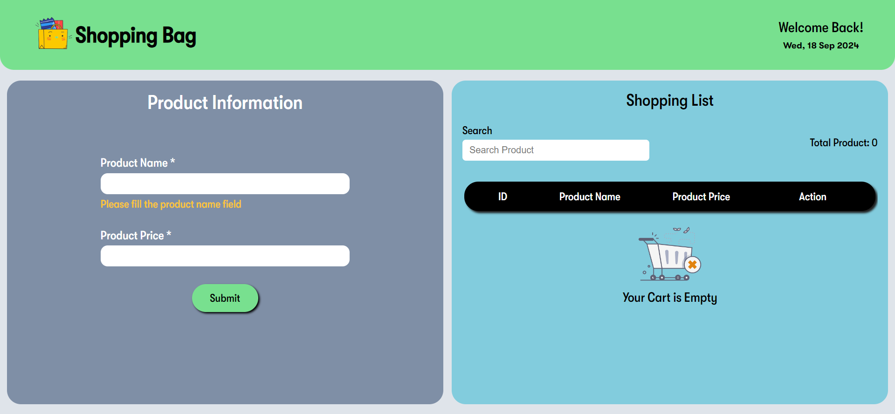

# 🛒 JavaScript Shopping Cart CRUD Application


## Description

A simple and responsive shopping cart built using HTML, CSS, and JavaScript. The application allows users to manage products by adding, editing, searching, and deleting items. Product validation ensures that product names are well-formatted, and only valid prices are accepted.

## ✨ Features

- <b>Add Products</b>: Add a new product by entering its name and price.
- <b>Edit Products</b>: Easily modify product details.
- <b>Delete Products</b>: Delete any product, with a confirmation modal for safety.
- <b>Search Products</b>: Search for a product by name.
- <b>Validation</b>:
  - Product names cannot start or end with spaces.
  - Product names cannot contain digits; they are automatically removed.
  - Prices can only contain numbers; non-numeric characters are automatically removed.
- <b>Responsive Design</b>: Fully responsive for mobile and desktop.
- <b>Toast Notifications</b>: Feedback messages for adding, editing, and deleting actions.
- <b>Empty Cart Handling</b>: A message will appear when there are no products in the cart.

## 📸 Screenshots



## 🚀 Demo

A live demo can be found [here](https://abdur-rahman-apu.github.io/Shopping-Bag/)

## 🛠️ Technologies Used

- <b>HTML5</b>: For structure and markup.
- <b>CSS3</b>: For styling and making the application responsive.
- <b>JavaScript (ES6)</b>: For implementing CRUD operations and validations.

## 🔥 Challenges Faced & Solutions

1. **Input Validation for Product Names**:

   - **Challenge**: Ensuring the product name does not start or end with spaces and does not contain digits.
   - **Solution**: Used `regular expressions` to automatically remove digits from the name.

2. **Handling Product Price Input**:

   - **Challenge**: Restricting the product price input to only allow numbers and ensuring no non-numeric characters could be entered.
   - **Solution**: Used `Regular expression` and allowed only numbers greater than zero.

3. **Confirmation Modal for Deleting a Product**:

   - **Challenge**: Providing a smooth user experience by confirming deletions without accidental actions.
   - **Solution**: Added a modal with a confirmation prompt to ensure users don't delete a product unintentionally.

4. **Making the Application Fully Responsive**:

   - **Challenge**: Ensuring the shopping cart is usable across different devices and screen sizes.
   - **Solution**: Used responsive CSS techniques like `flexbox` and `media queries` to adjust the layout on mobile and desktop devices.

5. **Dynamic Toast Messages**:

   - **Challenge**: Displaying toast messages for different actions like add, edit, and delete, and ensuring they disappear smoothly after a timeout.
   - **Solution**: Created reusable toast message components in JavaScript and applied `setTimeout()` to remove them after a short duration.

6. **No Third party library**
   - **Challenge**: Display toast and modal using only JavaScript to build my logic.
   - **Solution**: I implemented toast and modal using only JavaScript.

## 📚 What I Learned

1. **Input Validation in JavaScript**:

   - I learned how to effectively use **regular expressions** and string manipulation methods to handle complex validation scenarios such as ensuring that the product name does not start or end with spaces, and automatically removing digits.

2. **Responsive Design**:

   - This project enhanced my understanding of **CSS Flexbox** and **media queries**, allowing me to make the shopping cart fully responsive for various screen sizes, from mobile to desktop.

3. **Toast Messages**:

   - I improved my skills in creating dynamic **toast notifications** in JavaScript, learning how to build reusable components that can be easily triggered for different actions (add, edit, delete) and disappear smoothly after a set time.

4. **JavaScript Event Handling**:

   - I gained deeper knowledge about **event listeners** and how to handle form inputs in real-time, especially when preventing unwanted characters in the price field.

5. **Confirmation Modals**:

   - I learned how to implement a **confirmation modal** for deletion with a smooth user experience, using JavaScript to control the modal's opening and closing logic.

6. **Error Handling**:

   - I practiced handling errors gracefully, such as displaying appropriate messages when users try to submit empty products or invalid inputs.

7. **UI/UX Design Considerations**:
   - This project helped me appreciate the importance of **user-friendly interfaces**, especially in creating seamless interactions for CRUD operations.

## 📦 Installation

1.  Clone the repository:

```bash
git clone https://github.com/Abdur-Rahman-Apu/Shopping-Bag.git
```

2.  Open index.html in your browser.

## 🎯 Usage

- <b>Product Name</b>:
  - Cannot contain spaces at the beginning or end.
  - Cannot contain digits (they will be automatically removed).
- <b>Product Price</b>:
  - Only numeric values are allowed.
  - Non-numeric characters will be automatically removed.

## 🔔 Toast Notifications

- <b>Success Messages</b>: Displayed when products are added, edited, or deleted.
- <b>Error Messages</b>: Shown when trying to submit an empty product.

## 📱 Responsive Design

The shopping cart is fully responsive and works on both desktop and mobile devices, ensuring a seamless user experience across different screen sizes.

## Credits

This project was created as part of the [JavaScript Ninja Bootcamp](https://webdeveloperbd.net/js-bootcamp/).

## 📄 License

This project is licensed under the MIT License - see the [LICENSE](./LICENSE) file for details.
